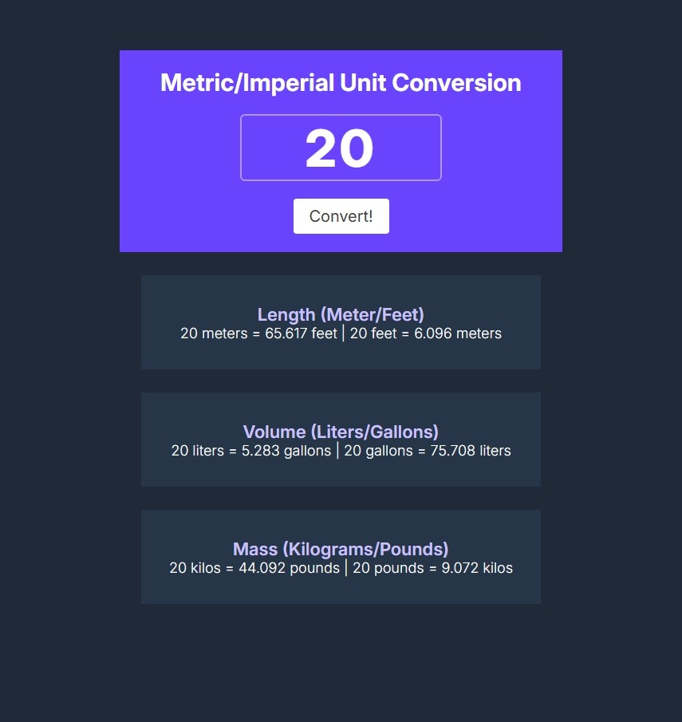

# Conversor de Unidades

See also in [English](./docs/README-EN.md)

## Descrição

Um site para conversão de unidades feito com HTML, CSS e JavaScript. Sendo parte do projeto solo "Unit Converter" na plataforma Scrimba. Este site proporciona uma interface simples para converter valores entre diferentes unidades de medida (comprimento, volume, massa).

## Recursos

- Interface Responsiva
- Conversão entre múltiplos tipos de unidades:
  - Comprimento (Metros, Pés)
  - Volume (Litros, Galões)
  - Massa (Quilos, Libras)
- Validação após a entrada para evitar erros

> [!NOTE]
> Não são permitidos valores menores que-9999, maiores 9999, e 0.

## Imagens

