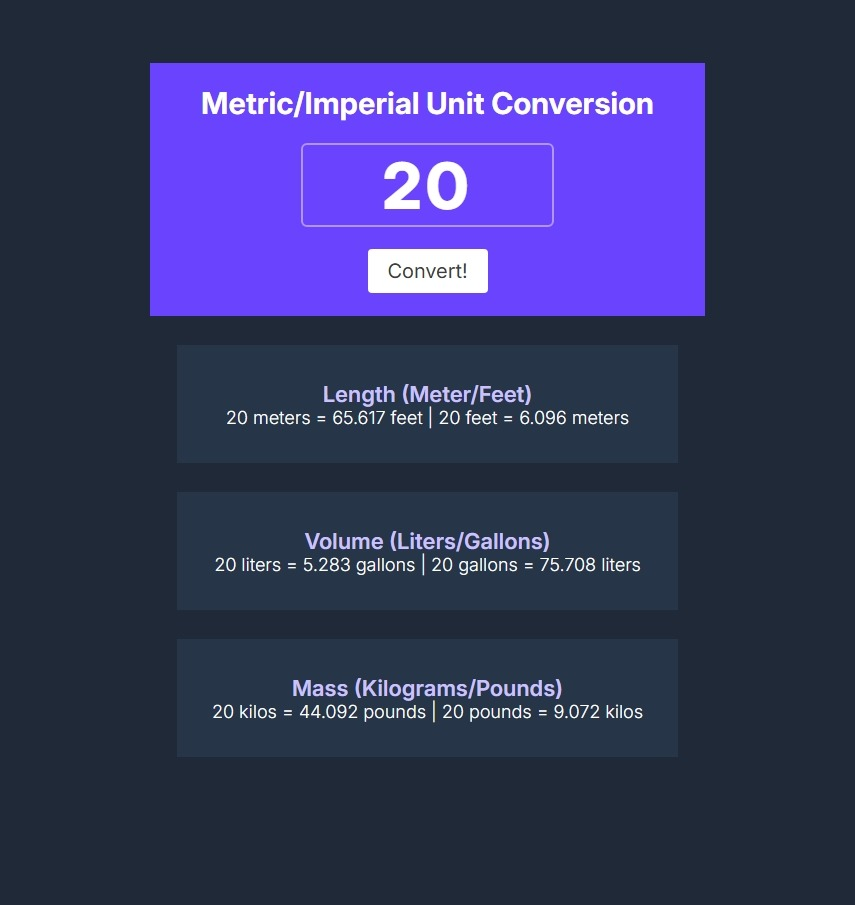

# Unit Converter

Veja também em [Português](../README.md)

## Description

A website for unit conversion made with HTML, CSS, and JavaScript. This project is part of the solo project "Unit Converter" on the Scrimba platform. The site provides a simple interface for converting values between different measurement units (length, volume, mass).

## Features

- Responsive Interface
- Conversion between multiple unit types:
  - Length (Meters, Feet)
  - Volume (Liters, Gallons)
  - Mass (Kilograms, Pounds)
- Input validation to avoid errors

> [!NOTE]
> Values less than -9999, greater than 9999, and 0 are not allowed.

## Images

